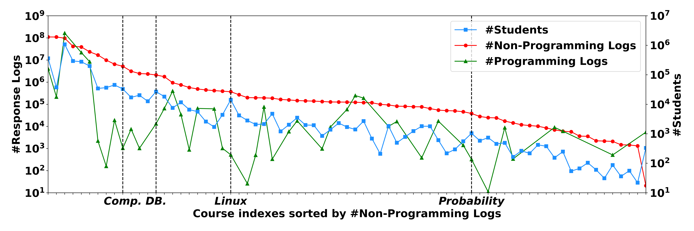

# PTADisc

PTADisc is sourced from  [PTA](https://pintia.cn/) (Programming Teaching Assistant), a learner-based online system  for universities and society developed by Hangzhou PAT Education Technology Co., Ltd.

 PTADisc is a diverse, immense, student-centered dataset that emphasizes its sufficient cross-course information for personalized learning. It includes $74$ courses, $1,530,100$ students, $4,504$ concepts, $225,615$ problems, and over $680$ million student response logs.

We illustrate the characteristics of PTADisc from the following four aspects:

- Diverse: PTADisc contains rich concept-related information and fine-grained records of a large number of student behaviors.
- Immense: PTADisc is the largest dataset in personalized learning. It also includes different courses of different data scales which offer options for various studies.
- Student-centered: In PTADisc, problems and knowledge concepts are validated based on student response logs, leading to better consistency and well-maintainability in terms of diagnostic tasks.
- Cross-course: PTADisc covers a significant amount of students taking multiple courses as students are likely to take a series of courses according to their training program.


### Data repository structure

Data can be downloaded [here](http://121.36.215.35/).

The directory is organized as:

```
data_baiteng/
└── task_specific_dataset
    ├── non_programming_dataset
    │   ├── baseline_dataset_for_CD
    │   ├── baseline_dataset_for_KT
    │   ├── cross_course_datasets
    │   └── datasets_for_CCLMF
    └── programming_datasets
```

| Leaf directory          | Content                                                      |
| ----------------------- | ------------------------------------------------------------ |
| baseline_dataset_for_CD | $4$ selected courses' datasets for cognitive diagnosis.      |
| baseline_dataset_for_KT | $4$ selected courses' datasets for knowledge tracing.        |
| cross_course_datasets   | datasets of $5$ courses which are simultaneously taken by $29,454$ students. |
| datasets_for_CCLMF      | *Java Programming* datasets and pretrained NCD model on *Python Programming*, which is used to conduct CCLMF experiments. |
| programming_datasets    | $4$ selected courses' datasets for knowledge tracing.        |


### Detailed information of structured data

For futher information, please contact: liyahu@zju.edu.cn.

#### Global Data

##### Description

Global data includes:

| Filename                        | Description                                                  |
| ------------------------------- | ------------------------------------------------------------ |
| knowledge_concept_all.csv       | The tree structure of all the knowledge concepts in PTADisc, which is in forms of `knowledge_point_id`, `name`, `parent_id`. |
| problem_to_difficulty.json      | Global dictionary of `problem_id` to `difficulty`.           |
| problem_to_knowledge.json       | Global dictionary of `problem_id` to `knowledge_id`.         |
| problem_to_reference_count.json | Global dictionary of `problem_id` to `reference_count`.      |
| problem_type                    | Global dictionary of `problem_id` to `problem_type`.         |
| psp_to_full_score.json          | Global dictionary of `problem_set_problem_id` to `full_score`. |
| psp_to_problem.json             | Global dictionary of `problem_set_problem_id` to `problem_id`. |
| psp_to_problem_set_id.json      | Global dictionary of `problem_set_problem_id` to `problem_set_id`. |

##### Knowledge Concept Example

`parent_id`=-1 indicates that it's the course's name, which is the root of its knowledge concept tree.

| knowledge_point_id | name               | parent_id |
| ------------------ | ------------------ | --------- |
| 383                | 概率论与数理统计   | -1        |
| 384                | 随机事件和概率     | 383       |
| 393                | 随机变量及概率分布 | 383       |
| 389                | 全概率公式         | 384       |
| 390                | 贝叶斯公式         | 384       |

##### Problem Type

```
enum ProblemType {
    NO_PROBLEM_TYPE = 0;
    TRUE_OR_FALSE = 1;  
    MULTIPLE_CHOICE = 2;  
    MULTIPLE_CHOICE_MORE_THAN_ONE_ANSWER = 3; 
    FILL_IN_THE_BLANK = 4; 
    FILL_IN_THE_BLANK_FOR_PROGRAMMING = 5; 
    CODE_COMPLETION = 6;  
    PROGRAMMING = 7; 
    SUBJECTIVE = 8;  
    MULTIPLE_FILE = 9;  
    }
```


#### Non-programming data

##### Description

Each course contains the following files:

| Filename              | Description                                                  |
| --------------------- | ------------------------------------------------------------ |
| info/info.json        | Record the number of the course's concepts, students, problems and logs. |
| info/concept_list.txt | Record the course's concept IDs.                             |
| info/student_list.txt | Record the course's student IDs.                             |
| info/problem_list.txt | Record the course's problem IDs.                             |
| problem_info.csv      | Record problems' `problem_set_problem_id`, `problem_id`, `knowledge_id`, `full_score` in the course. |
| response_log.csv      | Record logs' `submission_id`, `user_id`, `create_at`, `problem_type`, `score`, `problem_set_id`, `problem_set_problem_id`, `status` in the course. |

response_log.csv fields description:

- `submission_id`: the ID of one commit record of a problem set.
- `problem_type`: 1 represents true or false, 2 represents single-choice, 3 represents multiple-choice, and 4 represents fill-in-the-blank.
- `score`: the scoring ratio the student get on  this problem.
- `status`: auxiliary field to calculate student's score on this problem, contains *ACCEPTED*, *WRONG_ANSWER*, *PARTIAL_ACCEPTED*, etc.

##### Logs Example

| submission_id | user_id                                                      | create_at        | problem_type | score | problem_set_id | problem_set_problem_id | status       |
| ------------- | ------------------------------------------------------------ | ---------------- | ------------ | ----- | -------------- | ---------------------- | ------------ |
| 178060        | 0fa9733a132497dd515d426df206b67106364354b579231879e3c8f70630e431 | 2015/10/13 16:47 | 2            | 2     | 139            | 1746                   | ACCEPTED     |
| 178060        | 0fa9733a132497dd515d426df206b67106364354b579231879e3c8f70630e431 | 2015/10/13 16:47 | 2            | 0     | 139            | 1747                   | WRONG_ANSWER |
| 178060        | 0fa9733a132497dd515d426df206b67106364354b579231879e3c8f70630e431 | 2015/10/13 16:47 | 2            | 0     | 139            | 1748                   | WRONG_ANSWER |
| 178060        | 0fa9733a132497dd515d426df206b67106364354b579231879e3c8f70630e431 | 2015/10/13 16:47 | 2            | 2     | 139            | 1749                   | ACCEPTED     |
| 178060        | 0fa9733a132497dd515d426df206b67106364354b579231879e3c8f70630e431 | 2015/10/13 16:47 | 2            | 2     | 139            | 1750                   | ACCEPTED     |


#### Programming data

##### Description

Each course contains a response_log.csv with fields: `submission_id`, `user_id`,  `create_at`, `language` ,  `score`,  `problem_set_problem_id`,  `problem_id`,  `skill_id`,  `code`,  `response`, `time_consume`, `memory_consume`. Some  of the fields description:

- `submission_id`: the same as in non_programming data.
- `language`: the programming code 
- `score`: the same as in non_programming data.
- `code`: the code submitted by the student.
- `response`: the same as `status`in non_programming data.
- `time_consume`: time consumed by the submitted code.
- `memory_consume`: memory consumed by the submitted code.

##### Logs Example

| submission_id       | user_id                                                      | create_at           | language | score | problem_set_problem_id | problem_id          | skill_id | code                                                         | response     | time_consume | memory_consume |
| ------------------- | ------------------------------------------------------------ | ------------------- | -------- | ----- | ---------------------- | ------------------- | -------- | ------------------------------------------------------------ | ------------ | ------------ | -------------- |
| 1523963863660281856 | 82e2f8cab241392f2ffae8614297ed854b6113256c5c8d31cf2d14740a68706b | 2022-05-10 17:51:13 | Java     | 0.0   | 1523908485467762710    | 1013962033606774784 | 201      | import java.util.*;\npublic class Main {\n public static void  main(String[] args) {\n Scanner sc = new Scanner(System.in);\n int n =  sc.nextInt();\n List<Integer> list = new ArrayList<Integer>();\n  for (int i = 0; i < n; i++) {\n list.add(sc.nextInt());\n }\n  list.sort(Comparator.naturalOrder());\n  System.out.println(list.get(list.size()-2));\n }\n} | WRONG_ANSWER | 125          | 18404          |
| 1523963973706231808 | 82e2f8cab241392f2ffae8614297ed854b6113256c5c8d31cf2d14740a68706b | 2022-05-10 17:51:39 | Java     | 0.0   | 1523908485467762710    | 1013962033606774784 | 201      | import java.util.*;\npublic class Main {\n public static void  main(String[] args) {\n Scanner sc = new Scanner(System.in);\n int n =  sc.nextInt();\n List<Integer> list = new ArrayList<Integer>();\n  for (int i = 0; i < n; i++) {\n list.add(sc.nextInt());\n }\n  list.sort(Comparator.naturalOrder());\n  System.out.print(list.get(list.size()-2));\n }\n} | WRONG_ANSWER | 113          | 15232          |


#### Course Info

##### Description

The files of course info provide additional information of user group and problem set. Each course contains the following files:

| Filename                   | Description                                       |
| -------------------------- | ------------------------------------------------- |
| user_group_member.csv      | Record the user group members.                    |
| user_group_problem_set.csv | Record the opened problem sets for user groups.   |
| problem_set.csv            | Record the problem set's start time and end time. |

##### User Group Member Example

`user_group_member_id` is the id of a (`user_id`, `user_group_id`) pair.

| user_group_member_id | user_id                                                      | user_group_id       |
| -------------------- | ------------------------------------------------------------ | ------------------- |
| 1041674784427282432  | e7de9a3c1163736606a53e738cdb82a29f860903e84e14c61f13b31f82706d28 | 1041661419302744064 |
| 1041680824921296896  | 95c2f1226984fee4c1748e567279808b02e5128dbd1060ebd4692dbe164000a6 | 1041661579701325824 |
| 1041680824535420928  | 8e3f445a0fae30aef3daf067d1bebf648ca84181c21a924560f9a9a1f1d1504c | 1041661579701325824 |

##### User Group - Problem Set Example

| user_group_problem_set_id | user_group_id       | problem_set_id      |
| ------------------------- | ------------------- | ------------------- |
| 1053296011098509312       | 1041661579701325824 | 1053295797428080640 |
| 1053296069663563776       | 1041661419302744064 | 1053295797428080640 |
| 1057397021588357120       | 1041661419302744064 | 1057375475356430336 |

##### Problem Set Example

| problem_set_id      | start_at            | end_at              |
| ------------------- | ------------------- | ------------------- |
| 1057375475356430336 | 2018-11-02 12:00:00 | 2018-11-21 12:00:00 |
| 1118521024520945664 | 2019-04-17 22:24:00 | 2019-04-18 22:24:00 |
| 1119973878406443008 | 2019-04-21 22:38:00 | 2019-04-28 22:38:00 |


### Statistics




Detailed statistics of each course's students, problems, concepts, non_programming_logs and programming_logs can be found in [statistics.csv](https://github.com/wahr0411/PTADisc/blob/main/statistics.xlsx).


### CCLMF

Details can be found in [README.md](https://github.com/wahr0411/PTADisc/blob/main/CCLMF/README.md).


### Citation

```
@inproceedings{hu2023ptadisc,
  title={PTADisc: A Cross-Course Dataset Supporting Personalized Learning in Cold-Start Scenarios},
  author={Hu, Liya and Dong, Zhiang and Chen, Jingyuan and Wang, Guifeng and Wang, Zhihua and Zhao, Zhou and Wu, Fei},
  booktitle={Thirty-seventh Conference on Neural Information Processing Systems Datasets and Benchmarks Track},
  year={2023}
}
```

