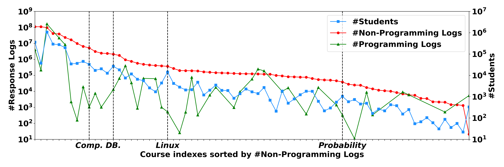

# PTADisc

PTADisc is sourced from  [PTA](https://pintia.cn/) (Programming Teaching Assistant), a learner-based online system  for universities and society developed by Hangzhou PAT Education Technology Co., Ltd.

 PTADisc is a diverse, immense, student-centered dataset that emphasizes its sufficient cross-course information for personalized learning. It includes $68$ courses, $1,527,974$ students, $2,506$ concepts, $220,649$ problems, and over $680$ million student response logs.

We illustrate the characteristics of PTADisc from the following four aspects:

- Diverse: PTADisc contains rich concept-related information and fine-grained records of a large number of student behaviors.
- Immense: PTADisc is the largest dataset in personalized learning. It also includes different courses of different data scales which offer options for various studies.
- Student-centered: In PTADisc, problems and knowledge concepts are validated based on student response logs, leading to better consistency and well-maintainability in terms of diagnostic tasks.
- Cross-course: it covers a significant amount of students taking multiple courses as students are likely to take a series of courses according to their training program.


### Data repository structure

Data can be downloaded [here](http://124.70.199.175/).

The directory is organized as:

```
data_baiteng/
├── scripts
├── structured_data
│   ├── global_data
│   ├── non_programming_data
│   └── programming_data
└── task_specific_dataset
    ├── non_programming_dataset
    │   ├── baseline_dataset_for_CD
    │   ├── baseline_dataset_for_KT
    │   ├── cross_course_datasets
    │   └── datasets_for_CCLMF
    └── programming_datasets
```

| leaf directory          | content                                                      |
| ----------------------- | ------------------------------------------------------------ |
| scripts                 | scripts which can conduct index mapping on structured data to generate final datasets for CD and KT |
| global_data             | global_data contains problem bank of all courses, including dictionaries of problem_to_difficulty, problem_to_knowledge, problem_to_reference_count, psp_to_full_score, psp_to_problem saves as .json files |
| non_programming_data    | intermediate structured data of $67$ courses, containing student list, concept list, problem list, Q-matrix file and processed response logs |
| programming_data        | intermediate structured data of $46$ courses, containing  processed response logs |
| baseline_dataset_for_CD | $4$ selected courses' datasets for cognitive diagnosis       |
| baseline_dataset_for_KT | $4$ selected courses' datasets for knowledge tracing         |
| cross_course_datasets   | datasets of $5$ courses which is simultaneously taken by $29,454$ students |
| datasets_for_CCLMF      | *Python Programming* and *Java Programming* datasets which is used to conduct CCLMF experiments |
| programming_datasets    | $4$ selected courses' datasets for knowledge tracing         |


### Statistics

Detailed statistics of each course's students, problem, concepts, non_programming_logs and programming_logs can be found in [statistics.csv]().


